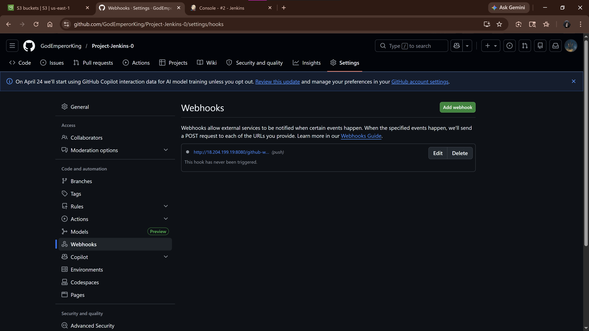
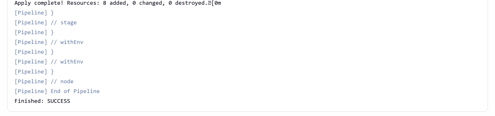
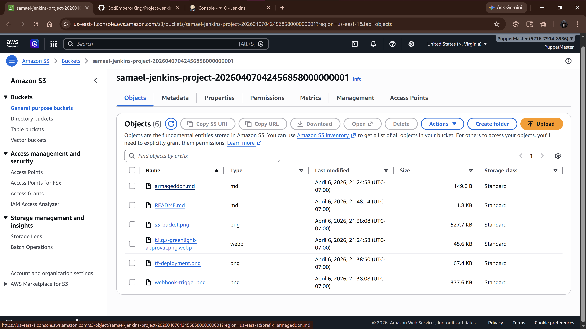
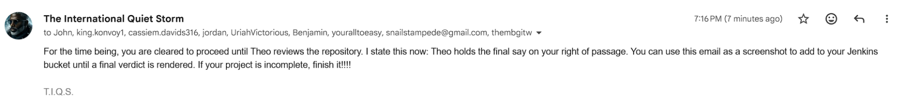

# Project-Jenkins-0: CI/CD Pipeline & AWS Infrastructure Automation

## 📌 Overview
This project demonstrates a fully automated Continuous Integration and Continuous Deployment (CI/CD) pipeline. It leverages Jenkins and GitHub Webhooks to automatically provision and manage AWS infrastructure (S3) using Terraform, adhering to Infrastructure as Code (IaC) best practices.

## 🛠️ Technology Stack
* **CI/CD:** Jenkins (Native AL2023 Installation), GitHub Webhooks
* **Infrastructure as Code:** Terraform
* **Cloud Provider:** Amazon Web Services (AWS)
* **Compute & Storage:** EC2 (t3.large), S3, IAM Roles

## 🚀 Key Engineering Features
* **Safe CI/CD Workflows:** Implemented a Declarative Jenkins Pipeline with a strict `plan-to-apply` methodology, preventing blind, auto-approved infrastructure deployments.
* **Dynamic State Management:** Utilized Terraform `for_each` loops with dynamic `lookup` functions to automatically assign correct MIME types (`content_type`) and ETags to S3 objects, ensuring proper browser rendering and state tracking.
* **Event-Driven Automation:** Configured GitHub Webhooks to trigger zero-touch Jenkins builds immediately upon code commits to the main branch.
* **Secure Authentication:** Bypassed hardcoded AWS access keys by utilizing native EC2 IAM Instance Profiles for secure, role-based AWS authentication.

---

## 📦 Project Deliverables

### 1. Webhook Trigger
*(Proof of automated pipeline trigger via GitHub push)*

### 2. Terraform Deployment
*(Jenkins console output showing successful plan and apply)*

### 3. S3 Bucket Provisioned
*(Verified AWS S3 bucket with uploaded metadata-corrected objects)*

### 4. Professor Greenlight
*(Approval for the refactored architecture)*

